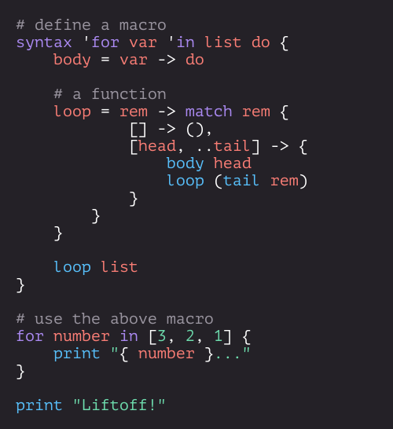

> **Note**: [Isaac](https://github.com/slightknack) is taking a two-year break from technology, and will no longer be developing Passerine. The project has been handed over to [Ben Siraphob](https://github.com/siraben), who will continue the maintence of the language and its community.

<p align="center">
    <a href="https://passerine.io">
        
    </a>
</p>
<h3 align="center">The Passerine Programming Language</h3>
<p align="center">Made with ♡ by Isaac Clayton and the Passerine Community – a cornerstone of the Veritable Computation Initiative.</p>
<p align="center">
    <a href="https://crates.io/crates/passerine">
        
    </a>
    <a href="https://docs.rs/passerine">
        
    </a>
    <a href="https://discord.gg/yMhUyhw">
        
    </a>
    <br>
    <br>
</p>

## Why Passerine?
[Passerine](https://www.passerine.io) is a small, concise, extensible functional scripting language, powered by a VM written in [Rust](https://www.rust-lang.org). Here's a small taste:

<p align="center">
    <a>
        
    </a>
</p>

Passerine has roots in Scheme and ML-flavored languages: it's the culmination of everything I expect from a programming language, including the desire to keep everything as minimalistic and concise as possible. At its core, Passerine is lambda-calculus with pattern-matching, structural types, fiber-based concurrency, and syntactic extension.

### Who started this?
Passerine was started by [Isaac Clayton](https://github.com/slightknack) at the end of 2019. In August of 2022, Isaac handed over the maintenece of Passerine and its community to his friend [Ben Siraphob](https://github.com/siraben).

A number of people have offered feedback and suggestions from time to time. Huge thanks to
[Raul](https://github.com/spaceface777),
[Hamza](https://github.com/hhhapz),
[Lúcás](https://github.com/cronokirby),
[Anton](https://github.com/jesyspa/),
[Yasser](https://github.com/realnegate),
[Shaw](https://github.com/shawsumma)†,
[Ben Siraphob](https://github.com/siraben)
[Plecra](https://github.com/plecra),
[IFcoltransG](https://github.com/IFcoltransG),
[Jack](https://github.com/nivpgir),
Xal,
[Zack](https://github.com/zack466),
[Mahmoud](https://github.com/fuzzypixelz)
and many others!

> Shaw is the developer of *MiniVM*, a portable cross-platform runtime. The eventual goal is to retire Passerine's current virtual machine, and adopt MiniVM Assembly (VASM), then later LLVM IR, as first-class targets of the compiler.

## An Overview
We've recently moved the Overview to a separate website, the [Passerine Codex*](https://codex.passerine.io/core/syntax.html), which can be read online.

> **Note**: Passerine is a *work in progress*: features mentioned in this overview may be unimplemented or subject to change.

## FAQ
**Q:** Is Passerine ready for production use?

**A:** Not yet! Passerine is still in early stages of development, with frequent breaking changes.

**Q:** Wait, why is the compiler broken on `master`?

**A:** In July of 2021, Isaac started a small PR to refactor a small part of the language, paving the way to integrate a typechecker. This PR was originally aimed at cleaning up a part of the codebase to make this integration easier.

Making this change required a small change to how the parser parsed expressions. This, in turn, required modifying the lexer. Passerine's old lexer was very bad, so instead of modifying the lexer, I rewrote the lexer from scratch. This changed the output of the lexer significantly, so I added an additional `read` pass to prepare the input for the macro system (which we had decided to modify as well). Because the output of the `read` pass differed greatly from what the parser expected, the parser had to be significantly rewritten as well.

Around the same time, it was decided to transition towards using MiniVM as a backend, given its high performance and ease of integration. This required modifying the existing VM to more closely match how MiniVM worked, which required the code generation pass to be modified as well.

Throughout this entire process, a little refactor that was meant to take a week turned into an entire rewrite of the codebase, taking over a year (and counting). Once all passes were finally complete, we put everything together. It was quickly discovered, however, that none of the passes matched, and nothing was compiling correctly anymore.

It was now March of 2022, and the product of 8 months of work was a broken compiler, each pass working individually (for the most part), but nothing working together. Around this time [Zack](https://github.com/zack466) and [Mahmoud](https://github.com/fuzzypixelz) started working on the refactor, and we were able to write property-based tests to fuzz the front-half of the compiler. Writing property-based tests for the back-half of the compiler is ongoing work.

In July of 2022, a year after this quick PR had started, the PR was nowhere close to being ready to merge. A part of this was out of fear of merging something that wasn't ready yet, and another part out of not having enough time to work on pushing the PR through to completion due to school and work.

At the end of July, we decided to bite the bullet, break the build on main, and merge `big-refactor`. This refactor is far from being completed, but now that we've let go of this large PR blocking prospective contributers, we invite prospective contributors to submit patches to help finish building this next iteration of Passerine.

The largest takeaway, in my opinion, is to scope changes, and build features incrementally. This big refactor turned massive rewrite is the exact opposite of a productive approach. Don't let refactors turn into rewrites!

**Q:** Is Passerine statically typed?

**A:** Currently Passerine is strongly and dynamically¹ typed (technically structurally typed). This is partially out of necessity – Types are defined by patterns, and patterns can be where predicated. However, I've been doing a lot of research into Hindley-Milder type systems, and the various extensions that can be applied to them.

I'm working towards making a compile-time type-checker for the language, based on Hindley-Milner type inference. With this system in place, I can make some assumptions to speed up the interpreter further and perhaps monomorphize/generate LLVM IR / WASM.

This type checker is actually the target of the next release, so stay tuned!

**Q:** What about algebraic effects and kind-based macros?

**A:** I'm interested in eventually adding both these things to the language, but first I need to implement a nice type-checker and do some more research. Algebraic Effects would fill the design space of fibers, and kind based macros would provide a more solid base for passerine's macro system. Got any fresh language features you think would complement Passerine's design philosophy? Reach out!

**Q:** What is vaporization memory management?

**A:** When I was first designing Passerine, I was big into automatic compile-time memory management. Currently, there are a few ways to do this: from Rust's borrow-checker, to µ-Mitten's Proust ASAP, to Koka's Perceus, there are a lot of new and exciting ways to approach this problem.

Vaporization is an automatic memory management system that allows for *Functional but in Place* style programming. For vaporization to work, three invariants must hold:

1. All functions params are passed by value via a copy-on-write reference. This means that only the lifetimes of the returned objects need to be preserved, all others will be deleted when they go out of scope.
2. A form of SSA is performed, where the last usage of any value is not a copy of that value.
3. All closure references are immutable copies of a value. These copies may be reference-counted in an acyclical manner.

With these invariants in place, vaporization ensures two things:

1. Values are only alive where they are still *useful*.
2. Code may be written in a functional style, but all mutations occur in-place as per rule 2.

What's most interesting is that this system requires minimal interference from the compiler when used in conjunction with a VM. All the compiler has to do is annotate the last usage of the value of any variables; the rest can be done automatically and very efficiently at runtime.

Why not use this? Mainly because of rule 3: 'closure references are immutable'. Passerine is pass-by-value, but currently allows mutation in the current scope a la let-style redefinition. But this is subject to change; and once it does, it's vaporization all the way, baby!

**Q:** Aren't there already enough programming languages?

**A:** Frankly, I think we've barely *scratched* the surface of programming language design. To say that Programming Language Design is saturated and at a local maxima is to not understand the nature of software development. Passerine is largely a test as to whether I can build a modern compiler pipeline. But what I'm even more interested in is the tooling that surrounds development environments.

Case in point: text-based entry for programming languages has been around forever because it's fast. However, it's not always semantically correct. The number of correct programs is an infinity smaller than the number of possible text files. Yet it's still possible to make text-based entry systems that ensure semantic correctness while encouraging exploration. In the future, we need to develop new tools that more closely blur the line between language and environment. Pharo is a step in the right direction, as are Unison and similar efforts.

I'd like to focus more on this in the future. An interesting project would be an editor/environment like Pharo/Unison for a small minimal language, like Scheme, or perhaps even Passerine.

## Installation
Passerine is still very much so a work in progress. We've done a lot, but there's still a so much more to do!

For you pioneers out there, The best way to get a feel for Passerine is to install *Aspen*¹, Passerine's package manager and CLI. If you use a *nix-style² system, run³⁴:

```bash
cargo install aspen
```

This will always install the latest *stable* version of Passerine. To get a feel for the current state of development hell, check out a local copy for your own enjoyment:

```
git clone https://github.com/vrtbl/passerine
```

> 1. If you're having trouble getting started, reach out on the community [Discord server](https://discord.gg/yMhUyhw).
> 2. Tested on Arch (btw) and macOS.
> 3. Now tested on Windows™!
> 4. In the future, we plan to distribute prebuilt binaries, but for now, a Rust install is required.

## Contributing
Contributions are welcome!
Read our [Contribution Guide](https://github.com/vrtbl/passerine/blob/master/CONTRIBUTING.md)
and join the [Discord server](https://discord.gg/yMhUyhw)
to get started!
