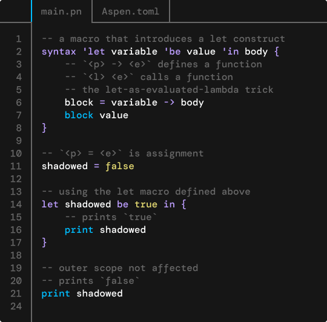

<p align="center">
    <a href="https://passerine.io">
        
    </a>
</p>
<h3 align="center">The Passerine Programming Language</h3>
<p align="center">Made with ♡ by Isaac Clayton and the Passerine Community – a cornerstone of the Veritable Computation Initiative.</p>
<p align="center">
    <a href="https://github.com/vrtbl/passerine/actions">
        
    </a>
    <a href="https://crates.io/crates/passerine">
        
    </a>
    <a href="https://docs.rs/passerine">
        
    </a>
    <a href="https://discord.gg/yMhUyhw">
        
    </a>
    <br>
    <br>
</p>

## Why Passerine?
Passerine is a small, concise, extensible functional scripting language, powered by a quick VM written in Rust.

<p align="center">
    <a href="#installation">
        
    </a>
</p>

### Who started this?
This is first project of The Veritable Computation Initiative. Our goal is to improve the tools developers use to write software.

Passerine is developed by [Isaac Clayton](https://github.com/slightknack), a high-school student with too much free time on his hands. A few people have offered feedback and suggestions from time to time. Special thanks to [Raul](https://github.com/spaceface777),
[Hamza](https://github.com/hhhapz),
[Lúcás](https://github.com/cronokirby),
[Anton](https://github.com/jesyspa/),
[Yasser](https://github.com/realnegate),
Xal,
and others!

## An Overview
Where this overview gets really exciting is when we dive into [macros](#macros).

**⚠️ Note that Passerine is a work in progress and that some features mentioned in this overview may not be implemented yet.**

[Skip to Installation](#installation).

### Rationale


### Syntax
Passerine has a very simple syntax. The goal of the syntax is to make all expressions as concise as possible while still maintaining a unique feel from expression to expression. We'll start simple, here's a function definition:

```plain
add_twice = value added -> value + 2 * added
add_twice 3 5
-- evaluates to 13
```

There are already some important thing to gleam from this small example:

Like other programming languages, Passerine uses `=` for assignment. On the left hand side is a *pattern* – in this case, just the variable `add_twice` – which destructures an expression into a set of bindings; On the right hand side is an *expression*, in this case, a function definition.

Unlike other programming languages, functions aren't 'special'. All functions are anonymous and take the form `p₀ ... pₙ -> e`, where `p` is a pattern, and `e` is an expression. Once all patterns have been matched, `e` is evaluated in a new scope with the appropriate bindings. Closures are permitted.

Passerine is an *expression-oriented* language, meaning that the distinction between statements and expressions isn't made. In the case that an expression produces no useful value, it should return the Unit type, `()`.

Passerine respects operator precedence. `3 + 2 * 5` is `13`, not `25`. Notation is a powerful tool – although Passerine is inspired by lisps like Scheme, we try to provide a syntax more familiar to most programmers.

Passerine uses whitespace for function calls. In other words, `l e` is a function call, where `l` is a lambda and `e` is an expression. Function calls are left-associative, so the call `a b c d` is `((a b) c) d`, not `(a (b (c d)))`. This syntax comes from functional languages like Haskell, and makes currying (partial application) quite intuitive.

Passerine uses `-- comment` for comments that continue until the end of the line. For nestable multi-line comments, use `-{ comment }-`.

Here's another slightly more complex example – a recursive quick-sort with questionable pivot selection:

```plain
sort = list -> match list [
    [] -> [],
    -- pivot is head, tail is remaining
    [head & tail] -> {
        higher = filter { x -> x >= head } tail
        lower  = filter { x -> x <  head } tail

        sort lower
            + [pivot]
            + sort higher
    }
]
```

The first thing that you should notice is the use of `{ ... }`. This is a *block*, a group of expressions executed one after another. Each expression in a block is separated by a newline or semicolon, the block taking on the value of its last expression.

The next thing to notice is this line:

```plain
(pivot, remaining) = (head list, tail list)
```

This is a more complex assignment than the one we used above. In this example, the pattern `(pivot, remaining)` is being matched against the expression `(head list, tail list)`. This pattern is a *tuple* destructure, and is equivalent to:

```plain
pivot     = head list
remaining = tail list
```

We'll delve deeper into pattern matching in the [next section](#pattern-matching).

Passerine also supports higher order functions (this should be no surprise):

```plain
filter { x -> x >= pivot } remaining
```

`filter` takes a predicate, which is a function, and an iterable, and produces a new iterable where the predicate is true for all items. But you knew that 😉. Although parenthesis would've been sufficient for the above example, it's stylistically more coherent to use parenthesis for grouping, and blocks for regions of computation.

Passerine allows splitting around operators to break up long expressions and to improve legibility of certain mathematical expressions:

```plain
sort lower
    + [pivot]
    + sort higher
```

Although this is not a particularly long expression, this simple example demonstrates what is possible.

### Pattern Matching
In the past section, we touched a little on pattern matching. I hope to go one step further with this and build a strong argument for why pattern matching in Passerine is so powerful. Patterns occur in three places:

1. Assignments
2. Functions
3. Types

Patterns mirror the data that they match against. Passerine supports algebraic data types, and all of these collection types can be matched and destructured against. for the examples, `p` is a nested sub-pattern.

| pattern  | example          | destructures |
| -------- | ---------------- | ------------ |
| variable | `foo`            | Terminal pattern, binds an expression to a variable. |
| data     | `420.69`         | This is data that *must* match. Raises an error otherwise – see the following section on fibers and concurrency to get an idea of how errors work in Passerine. |
| discard  | `_`              | Matches any data, does not produce a binding. |
| label    | `Baz p`          | Matches a label, i.e. a *type* in Passerine. We'll get into this later. |
| tuple    | `(p₀, ...)`      | Matches each element of a tuple, which is a group of elements, potentially of different types. Unit `()` is the empty tuple. |
| list     | `[]`/`[p₀ & p₁]` | `[]` Matches an empty list - `p₀` matches the head of a list, p₁ matches the tail.
| record   | `{f₀: p₀, ...}`  | A record, i.e. a struct. This is a series of field-pattern pairs. If a field does not exist in the target record, an error is raised. |
| is       | `p₀: p₁`         | A type annotation. Matches against `p₀` only if `p₁` holds, errors otherwise. |
| where    | `p \| e`         | A bit different from the other patterns so far. Matches `p` only if the expression `e` is true. |

That's quite a lot of information, so let's work through it. The simplest case is a standard assignment. You've already seen this, so let's begin by discussing matching against data.

The function:

```plain
true second -> second
```

will return the second argument if the first argument passed to the function is `true`. If this is not the case, Passerine will yell at us:

```plain
Fatal Traceback, most recent call last:
In src/main.pn:1:1
   |
 1 | (true second -> second) false "Bananas!"
   | ^^^^^^^^^^^^^^^^^^^^^^^^^^^^^
   |
In src/main.pn:1:2
   |
 1 | (true second -> second) false "Bananas!"
   |  ^^^^
   |
Runtime Pattern Matching Error: The data 'false' does not match the expected data 'true'
```

Discard is another simple pattern – it does nothing. It's most useful when used in conjunction with other patterns:

```plain
-- to ensure an fruit has the type Banana:
banana: Banana _ = mystery_fruit

-- to ignore an item in a tuple:
(_, plays_tennis, height_in_feet) = ("Juan Milan", true, 27.5)

-- to ignore a field on a record:
{ name: "Isaac Clayton", age: _, skill } = isaac
```

A label is a name given to a types. Of course, names do not always imply type safety, but they do do a darn good job, most of the time:

```plain
-- make a soft yellow banana:
banana = Banana ("yellow", "soft")

-- check that the banana flesh is soft:
if { Banana (_, flesh) = banana; flesh == "soft" } {
    print "Delicioso!"
}
```

Pattern matching on labels is used to extract the data that is used to construct that label. Tuples are fairly simple and we already covered them, so we'll cover records next. A record is a set of fields:

```plain
-- define the Person type
type Person {
    name:  String,
    age:   Natural,
    skill: String,
}

-- Make a person. It's me!
isaac = Person {
    name:  "Isaac Clayton",
    age:   16,
    skill: "High enough ¯\_(ツ)_/¯",
}
```

Here's how you can pattern match on `isaac`:

```plain
Person {
    -- aliasing a `name` as `full_name`
    name: full_name,
    -- `age` is ignored
    age: _,
    -- short for `skill: skill`
    skill,
} = isaac
```

Of course, the value after `:` is a full pattern, and can be matched further with nested patterns.

Finally, we'll address my favorite pattern, *where*. Where allows for arbitrary code check the validity of a type. This can go a long way. For example, let's define natural numbers in terms of integers numbers:

```
type Natural n: Integer | n >= 0
```

This should be read as:

> the type Natural, is an Integer n, where n is greater than 0

With this definition in place:

```
-- this is valid
seven = Natural 7

-- this will error
negative_six = Natural -6
```

As you can imagine, this is more powerful than ensuring type constructors are correct. Where clauses in patterns ensure that the underlying data can never break an underlying invariant.

> TODO: traits and impls.
> TODO: match

Pattern matching and algebraic data types allow for quickly building up and tearing down expressive data schemas.

### Fibers
How does passerine handle errors? What about concurrency?

Structured concurrency is a difficult problem to tackle, given how pervasive it is in the field language design. What do prime sieves, exceptions, and for-loops have in common? If you guessed concurrency, you won a bajillion points!

It's important to point out that concurrency is *not* the same thing as parallelism. Concurrent systems may be parallel, but that's not always the case. Passerine subscribes to the coroutine field of structured concurrency, more succinctly, Passerine uses *fibers*, as exemplified by Wren. A fiber is a *lightweight* process of execution that is cooperatively scheduled with other fibers. Each fiber is like a little system unto itself that can pass messages to other fibers.

#### Error handling
Passerine uses a combination of *exceptions* and algebraic data types to handle errors. Errors that are expected should return a `Result` type:

```
validate_length = n -> {
    if length n < 5 {
        Result.Error "It's too short!"
    } else {
        Result.Ok n
    }
}
```

Some errors, however are unexpected. There are millions of ways software can fail; to account for external circumstances is impossible in some cases. In the case that something that isn't expected to fails fails, an exception is raised. For example, trying to open a file that should exist may through an exception.

```
config = parse_config (open "config.toml")
```

The reason we don't always need to catch these errors is because Passerine follows a fail-fast, fail-safe philosophy. In this regard, Passerine subscribes to the model of Erlang/Elixir:

> "Keep calm and let it crash."

The good news is that crashes are local to the fiber they occur in – a single fiber crashing does not bring the whole system down. The idiomatic way to handle an operation that may crash is to try it. This performs the operation in a new fiber and converts any exceptions that may occur into a `Result`:

```
config = match (try (open "config.toml")) [
    Result.Ok    file  -> Config.parse file,
    Result.Error error -> Config.default,
]
```

If something exceptionally bad *does* happen, use the `error` keyword:

```
doof = platypus -> {
    if platypus == "Perry" {
        -- crashes the current fiber
        error "What!? Perry the platypus!?"
    } else {
        "Oh, it's just a platypus..."
    }
}
```

Note that the value of raised errors can be anything. This allows for programmatic recovery from errors:

```
-- socket must not be disconnected
send_data = socket data -> {
    match socket.connection [
        Option.None -> error Disconnected socket
        Option.Some connection -> connection.write data,
    ]

    ()
}
```

Let's say the above code tries to send some data through a socket. To handle a disconnection, we can try the error:

```
ping = socket -> try (send_data socket "ping")

socket = Socket.new ... -- whatever
socket.disconnect -- oh no!

result = ping socket

match result [
    Result.Ok "pong" -> (),
    Result.Error Disconnected socket -> socked.connect,
]
```

Why make the distinction between expected errors (`Result`) and unexpected errors (fiber crashes)? Programs only produce valid results if the environments they run in are valid. When a fiber crashes, it's signaling that something about the environment it's running in is not valid. This is very useful to *developers* during development, and very useful to *programs* in contexts where complex long-running applications may fail for any number of reasons. Why not only use exceptions then? Because it's perfectly possible for an error to occur that is not exceptional at all. Malformed input, incorrect permissions, missing items – these are all things that can occur and do occur on a regular basis.

#### Concurrency
Fibers are for more than just isolating the context of errors. As mentioned earlier:

> A fiber is a *lightweight* process of execution that is cooperatively scheduled with other fibers. Each fiber is like a little system unto itself that can pass messages to other fibers.

Fibers are full *coroutines*. To create a fiber, use the fiber keyword:

```
counter = fiber {
    i = 0
    loop { yield i; i = i + 1 }
}

print counter () -> prints 0
print counter () -> prints 1
print counter () -> ...
```

The `yield` keyword suspends the current fiber and returns a value to the calling fiber. It

```
passing_yield = fiber {
    print "hello"
    result = yield "banana"
    print result
    "yes"
}

passing_yield "first"  -- prints "hello" then evaluates to "banana"
passing_yield "second" -- prints "second" then evaluates to "yes"
passing_yield "uh oh"  -- raises an error, fiber is done
```

To build more complex systems, you can build fibers with functions:

```
-- a function that returns a fiber
flopper = a b -> fiber {
    loop {
        yield a
        yield b
    }
}

banana_apple = flopper "Apple" "Banana"

banana_apple () -- evaluates to "Apple"
banana_apple () -- evaluates to "Banana"
banana_apple () -- evaluates to "Apple"
banana_apple () -- ... you get the point
```

<!--
Of course, the possibilities are endless. There's one last thing I'd like to discuss before we start talking about macros. Fibers, while usually being ran in the context of another, all act as peers to each-other. If you have a reference to a fiber, it's possible to transfer to it forgetting the context in which it was called. To switch to a fiber, use `switch`.

```
banana_and_end = fiber {
    print "banana ending!"
}

print "the beginning..."
switch banana_and_end
print "the end."
```

`"the end."` is never displayed.

-->

> 'Tis not the end, 'tis but the beginning...

### Macros
Passerine has a rich hygienic syntactic macro system that extends the language itself¹.

> 1. Having read Doug Hoyte's [Let Over Lambda](https://letoverlambda.com/), I understand the power that a rich *unhygenic* macro system brings. However, such systems are hard to master – Passerine aims to be as simple and powerful as possible without sacrificing transparency – and much can still be accomplished through

## Installation
Passerine is still very much so a work in progress. We've done a lot, but there's still a so much more to do!

For you pioneers out there, The best way to get a feel for Passerine is to install [Aspen](https://github.com/vrtbl/aspen)¹.

If you use a *nix-style² system, run³:

```bash
sh <(curl -sSf https://www.passerine.io/install.sh)
```

> 1. If you're having trouble getting started, reach out on the community Discord server.
> 2. Tested on Arch (btw) and macOS.  
> 3. In the future, we plan to distribute prebuilt binaries, but for now, both Git and Cargo are required.

## Roadmap
See the [Project Roadmap](https://github.com/vrtbl/passerine/projects/1) to get a feel for what's currently under development.

## Contributing
Contributors welcome!
Read our [Contribution Guide](https://github.com/vrtbl/passerine/blob/master/CONTRIBUTING.md)
and join the [Discord server](https://discord.gg/yMhUyhw)
to get started.
